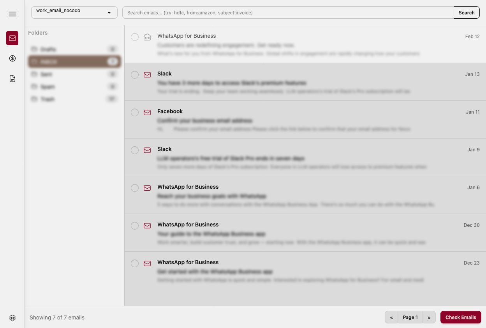
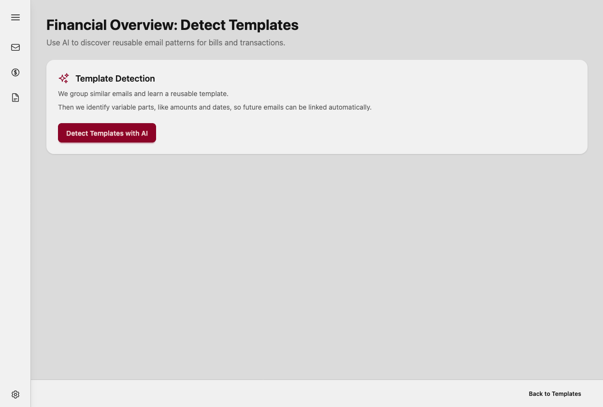
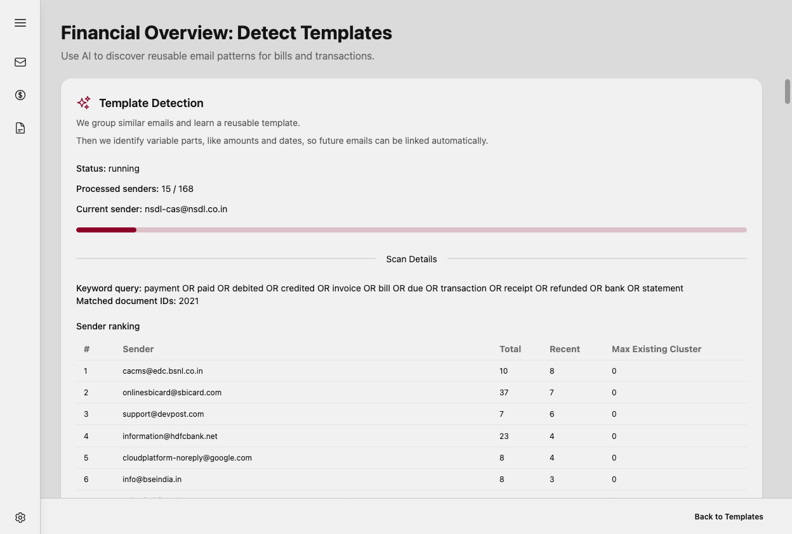
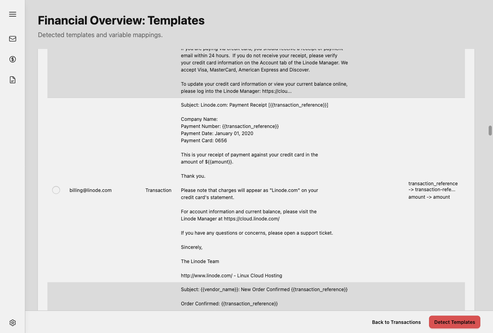
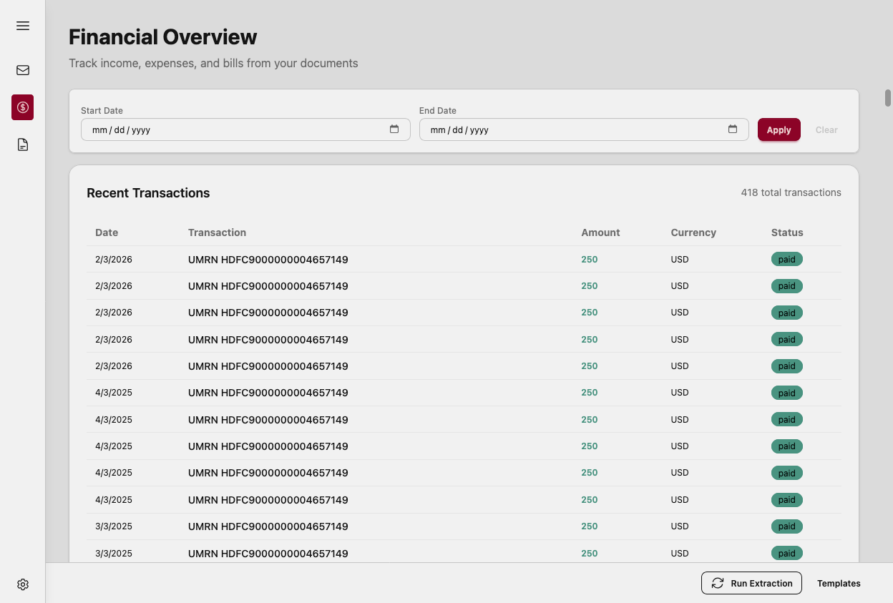
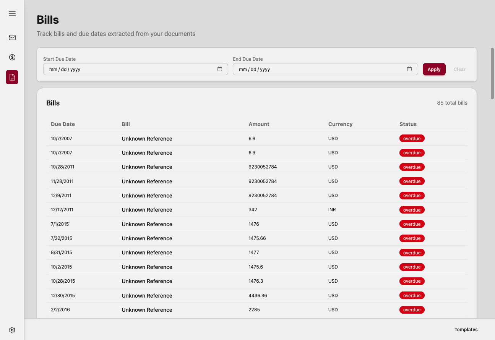
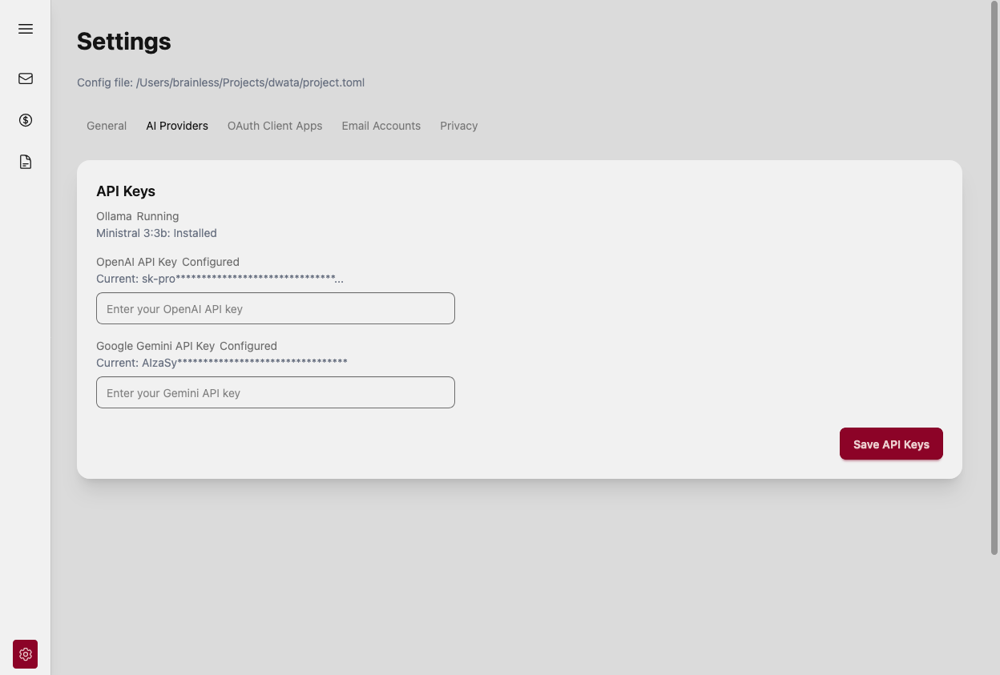

# Dwata

Connect your email inbox, download emails, and use LLM agents to extract financial transaction data — all running locally on your machine.

**All data stays on your machine.** dwata works with Ollama and local models (tested on Mac Mini M4 16GB), so your emails never leave your computer.

> [!WARNING]
> dwata is very early software and is being developed actively, I am sorry if the extracted data has bugs.

## What dwata does today

### Email inbox

Connect your Gmail or IMAP account. dwata downloads your emails and stores them locally in SQLite.



### Financial template detection

Select financial emails and run an LLM agent to generate extraction templates. The agent reads sample emails and produces reusable patterns — you only need AI once per email sender.





### Financial templates

Browse and manage the generated templates. Each template captures how to extract financial data from a specific sender.



### Extracted transactions

Once templates are in place, dwata extracts financial transactions from matching emails automatically.

> [!WARNING]
> There are quite a few issues with the extraction logic. I am working on it actively.





### LLM settings

Use Ollama with a local model (Ministral 3: 3b), OpenAI (GPT-4o Nano), or Google Gemini (Gemini 2.5 Flash Preview). Switch models in settings.



## Privacy

- All email data is stored locally in SQLite — never sent to a cloud service
- With Ollama, template detection runs entirely on your machine with no external API calls
- OS keychain stores credentials (Gmail password / OAuth tokens) — dwata uses a single keychain entry so you get one prompt on first launch
- On macOS, select **Always Allow** when the keychain prompt appears so you're not asked again

## Getting started

Download the latest release for your platform from [GitHub Releases](https://github.com/brainless/dwata/releases).

Launch the Dwata desktop app (Tauri). It starts the `dwata-api` sidecar automatically and loads the GUI inside the app window.

### Connecting Gmail

dwata supports Gmail via OAuth. Set your Google OAuth `client_id` and `client_secret` in the config file:

- **macOS**: `~/Library/Application Support/dwata/project.toml`
- **Linux**: `~/.config/dwata/project.toml`
- **Windows**: `%APPDATA%\dwata\project.toml`

You can use your own Google OAuth app (bring-your-own credentials).

### Using Ollama

Install [Ollama](https://ollama.com) and pull model [Ministral 3:3b](https://ollama.com/library/ministral-3:3b):

```bash
ollama pull ministral-3:3b
```

Then set the model in dwata's settings page.

## Tech stack

- **Backend**: Rust + Actix-web
- **Database**: SQLite (local)
- **Frontend**: SolidJS
- **UI Components**: DaisyUI
- **LLM**: Ollama (local), OpenAI, or Google Gemini

## Support

- **Bugs & issues**: [GitHub Issues](https://github.com/brainless/dwata/issues)
- **Discussions**: [GitHub Discussions](https://github.com/brainless/dwata/discussions)
- **Developer guide**: [DEVELOP.md](DEVELOP.md)

## License

GPL v3 — see [LICENSE](LICENSE).

## From the founder

I am Sumit, and I live in a small eastern Himalayan village in India. I mentor/co-mentor hundreds of folks each month about how to use coding agents. I run a digital nomad space in our village. Come, say Hi!

- [Curry Hostel](https://www.instagram.com/curryhostel)
- [Me on YouTube](https://www.youtube.com/@nomadsome)
- [Sponsor me on GitHub](https://github.com/sponsors/brainless)
